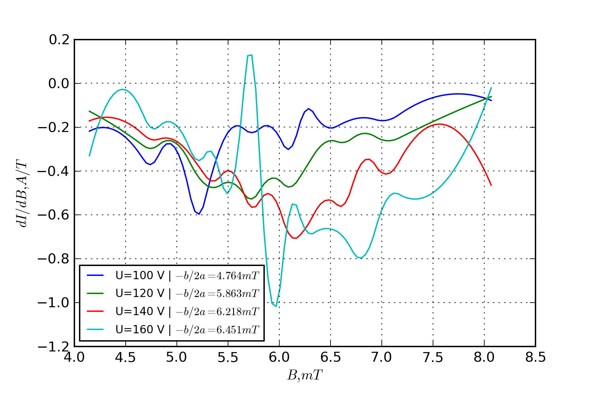

% Elektrona lādiņš (7)
% Jānis Erdmanis (je11011)

#An h1 header

Paragraphs are separated by a blank line.

2nd paragraph. *Italic*, **bold**, `monospace`. Itemized lists
look like:

  * this one
  * that one
  * the other one

Note that --- not considering the asterisk --- the actual text
content starts at 4-columns in.

> Block quotes are
> written like so.
>
> They can span multiple paragraphs,
> if you like.

Use 3 dashes for an em-dash. Use 2 dashes for ranges (ex. "it's all in
chapters 12--14"). Three dots ... will be converted to an ellipsis. Garš tekstGarš tekstGarš tekstGarš tekstGarš tekstGarš tekstGarš tekstGarš tekstGarš tekstGarš tekstGarš tekstGarš tekstGarš tekstGarš tekstGarš tekstGarš tekstGarš tekstGarš tekstGarš tekstGarš tekstGarš tekstGarš tekstGarš tekstGarš tekstGarš tekstGarš tekstGarš tekstGarš tekstGarš tekstGarš tekstGarš tekstGarš tekstGarš tekstGarš tekstGarš tekstGarš tekstGarš tekstGarš tekstGaršekstGarš tekstGarš tekstGarš tekstGarš tekstGarš tekstGarš tekstGarš tekstGarš tekstGarš tekstGarš tekstGarš tekstGarš tekstGarš tekstGarš tekstGarš tekstGarš tekstGarš tekstGarš tekstGarš tektGarš tekstGarš tekstGarš tekstGarš tekstGarš tekstGarš tekstGarš tekstGarš tekstGarš tekstGarš tekstGarš tekstGarš tekstGarš tekstGarš tekstGarš tekstGarš tekstGarš tekstGarš tekstGarš tekstGarš tekstGarš tekstGarš tekstGarš tekstGarš tekstGarš tekstGarš tekstGarš tekstGarš tekstGarš tekstGarš tekstGarš tekstGarš tekstGarš tekstGarš tekstGarš tekstGarš tekstGarš tekstGarš tekstGarš tekst

Garš tekstGarš tekstGarš tekstGarš tekstGarš tekstGarš tekstGarš tekstGarš tekstGarš tekstGarš tekstGarš tekstGarš tekstGarš tekstGarš tekstGarš tekstGarš tekstGarš tekstGarš tekstGarš tekstGarš tekstGarš tekstGarš tekstGarš tekstGarš tekstGarš tekstGarš tekstGarš tekstGarš tekstGarš tekstGarš tekstGarš tekstGarš tekstGarš tekstGarš tekstGarš tekstGarš tekstGarš tekstGarš tekstGarš tekstGarš tekstGarš tekstGarš tekstGarš tekstGarš tekstGarš tekstGarš tekstGarš tekstGarš tekstGarš tekstGarš tekstGarš tekstGarš tekstGarš tekstGarš tekstGarš tekstGarš tekstGarš tekst

##Teorētiskais pamatojums
Viegli ir iekļauļamas arī matemātikas sakarības $x^2$ vai arī jaunā rindā:

$$x^2$$

##An h2 header

Here's a numbered list:

 1. first item
 2. second item
 3. third item

Note again how the actual text starts at 4 columns in (4 characters
from the left side). Here's a code sample:

    # Let me re-iterate ...
    for i in 1 .. 10 { do-something(i) }

Kā arī ir iekļauļamas latex komandas:

\csvautotabular{build_markdown/dati.csv}

